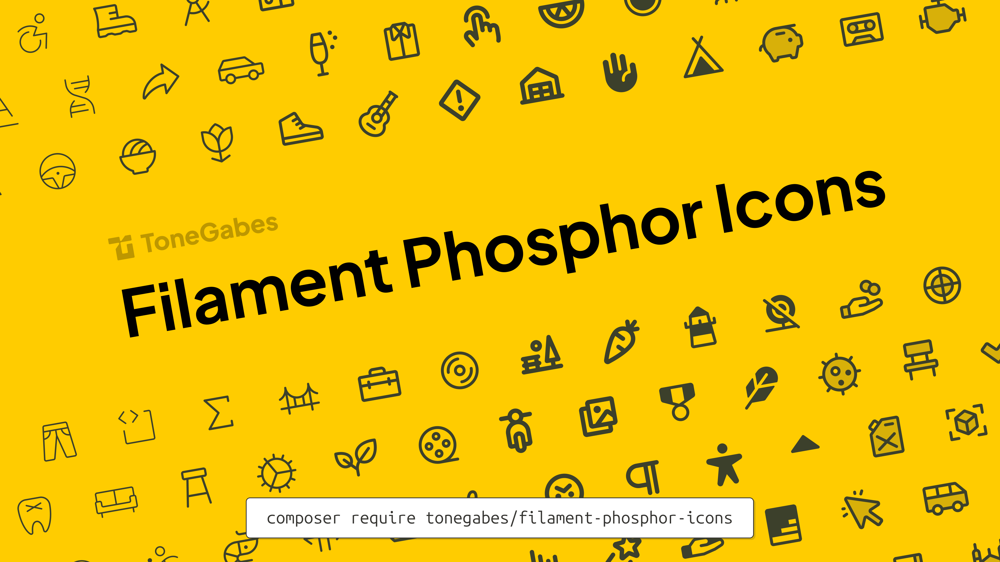

<p align="center">
    
</p>

# Filament Phosphor Icons

A Phosphor icon set ready to be used as Enums in a Filament 4 application.

## Installation

You can install the package via composer:

```bash
composer require tonegabes/filament-phosphor-icons
```

## Usage

All icons are available through an enum providing convenient usage throughout your Filament app. For more information, check the [Filament docs](https://filamentphp.com/docs/4.x/styling/icons).

For all available icons check the [Phosphor Icons](https://phosphoricons.com/).

```php
use Filament\Actions\Action;
use Filament\Forms\Components\Toggle;
use ToneGabes\Filament\Icons\Enums\Phosphor;

Action::make('star')
  ->icon(Phosphor::StarBold);

Toggle::make('is_starred')
  ->onIcon(Phosphor::Star)
```

## Variant helpers

For convenience, the enum includes helper methods so you can quickly switch or force icon weights on the enum value:

- thin
- light
- regular
- bold
- fill
- duotone

```php
use Filament\Forms\Components\Toggle;
use ToneGabes\Filament\Icons\Enums\Phosphor;

// Approach 1
Toggle::make('is_starred')
    ->onIcon(Phosphor::StarFill)
    ->offIcon(Phosphor::Star)
;

// Approach 2
Toggle::make('is_starred')
    ->onIcon(Phosphor::Star->fill())
    ->offIcon(Phosphor::Star->regular());
```

Important: note that helper methods override the enum case's default style. For example, even if you pick a bold case, calling a helper will switch the weight:

```php
// Overrides the default bold case to thin at runtime
Action::make('star')->icon(Phosphor::StarBold->thin());

// You can use 'forceWeight' to set weight based on a variable
Action::make('star')->icon(Phosphor::StarBold->forceWeight($var));
```

## Usage in Blade

If you would like to use an icon in a Blade component, you can pass it as an attribute:

```php
@php
    use ToneGabes\Filament\Icons\Enums\Phosphor;
@endphp

<x-filament::badge :icon="Phosphor::Star">
    Star
</x-filament::badge>

```

## Credits

- [Tone Gabes](https://github.com/tonegabes)
- [Phosphor icons](https://phosphoricons.com)
- [All Contributors](../../contributors)

## License

The MIT License (MIT). Please see [License](LICENSE.md) for more information.
