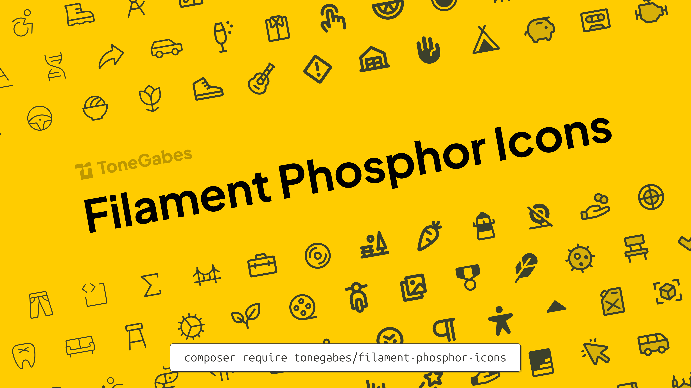

<p align="center">
    
</p>

# Filament Phosphor Icons

A Phosphor icon set ready to be used as Enums in Filament 4 and 5 applications.

## Installation

You can install the package via composer:

```bash
composer require tonegabes/filament-phosphor-icons
```

## Usage

All icons are available through an enum providing convenient usage throughout your Filament app. For more information, check the [Filament 4 docs](https://filamentphp.com/docs/4.x/styling/icons) or the [Filament 5 docs](https://filamentphp.com/docs/5.x/styling/icons).

For all available icons check the [Phosphor Icons](https://phosphoricons.com/).

```php
use Filament\Actions\Action;
use Filament\Forms\Components\Toggle;
use ToneGabes\Filament\Icons\Enums\Phosphor;

Action::make('star')
  ->icon(Phosphor::StarBold);

Toggle::make('is_starred')
  ->onIcon(Phosphor::Star)
```

## Weights

This package includes a enum with weights you can use:

```php
enum Weight: string
{
    case Thin = 'thin';
    case Light = 'light';
    case Fill = 'fill';
    case Duotone = 'duotone';
    case Bold = 'bold';
    case Regular = 'regular';
}

```

Use it to force a certain style:

```php
use Filament\Forms\Components\Toggle;
use ToneGabes\Filament\Icons\Enums\Phosphor;
use ToneGabes\Filament\Icons\Enums\Weight;

// Simple
Toggle::make('is_starred')
    ->onIcon(Phosphor::StarFill)
    ->offIcon(Phosphor::Star)
;

// Forcing with enum
Toggle::make('is_starred')
    ->onIcon(Phosphor::Star->forceWeight(Weight::Fill))
    ->offIcon(Phosphor::Star->forceWeight(Weight::Regular));

// You can use 'forceWeight' to set weight based on a Weight enum or string value
Action::make('star')->icon(Phosphor::StarBold->forceWeight($var));

```

## Helpers

For convenience, this package also comes with helper methods to improve DX and make more dynamic code:

```php
// Overrides the default bold case to another at runtime
  ->icon(Phosphor::StarBold->thin());
  ->icon(Phosphor::StarBold->light());
  ->icon(Phosphor::StarBold->regular());
  ->icon(Phosphor::StarBold->fill());
  ->icon(Phosphor::StarBold->bold());
  ->icon(Phosphor::StarBold->duotone());
```

You can also use with conditions:

```php
// Approach 1
IconColumn::make('is_favorite')
    ->icon(fn (string $state) => match ($state) {
        true => Phosphor::HeartFill,
        false => Phosphor::Heart,
    })

// Approach 2
IconColumn::make('is_favorite')
    ->icon(fn (string $state) => Phosphor::Heart->fill($state))
```

### Weight checks

Check the weight of an icon case at runtime:

```php
Phosphor::StarBold->isBold();      // true
Phosphor::StarFill->isFill();      // true
Phosphor::StarDuotone->isDuotone(); // true
Phosphor::StarLight->isLight();    // true
Phosphor::StarThin->isThin();      // true
Phosphor::Star->isRegular();       // true
```

### Listing icons

Retrieve all icons or filter them by weight. These methods return icon labels with the `phosphor-` prefix:

```php
// All icons
Phosphor::getAllIcons();

// Filter by weight
Phosphor::getRegularIcons();
Phosphor::getBoldIcons();
Phosphor::getFilledIcons();
Phosphor::getDuotoneIcons();
Phosphor::getLightIcons();
Phosphor::getThinIcons();
```

## Usage in Blade

If you would like to use an icon in a Blade component, you can:

```php
@php
    use ToneGabes\Filament\Icons\Enums\Phosphor;
@endphp

// Use it as attribute
<x-filament::badge :icon="Phosphor::Star">
    Star
</x-filament::badge>

// Use it as svg directive
@svg(Phosphor::Star->getLabel())

// Use it as svg helper
{{ svg(Phosphor::Star->getLabel()) }}

// Use it as component
<x-icon name="{{ Phosphor::Star->getLabel() }}" />

```

## Commands

This package gives you an artisan command, so you can sync Phosphor icons from Blade icons to this package enum.
It is, of course, a temporary solution in case new icons have dropped and this package is not updated yet.

```php
php artisan phosphor:sync
```

By default, the command updates the enum file inside this package. You can preview the result or point it to a specific enum path:

```bash
php artisan phosphor:sync --dry-run
php artisan phosphor:sync --enum-path=src/Enums/Phosphor.php
```

## Credits

- [Tone Gabes](https://github.com/tonegabes)
- [Phosphor icons](https://phosphoricons.com)
- [All Contributors](../../contributors)

## License

The MIT License (MIT). Please see [License](LICENSE.md) for more information.
